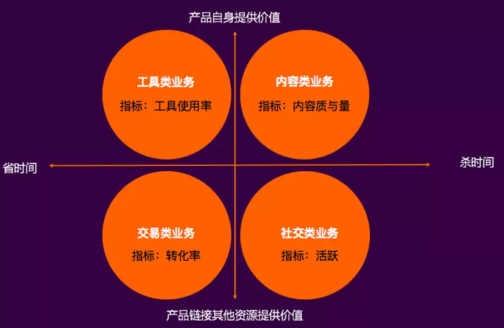
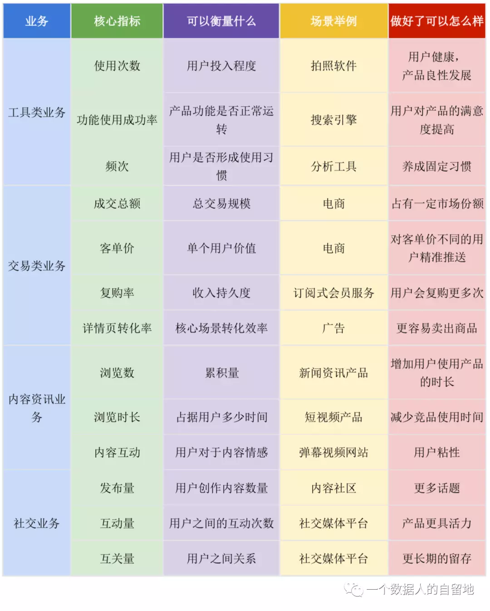

# 建立指标体系

指标，是反映某种事物或现象，描述在一定时间和条件下的规模、程度、比例、结构等概念，通常由指标名称和指标数值组成。

## 1.明确业务目的，确定核心指标

根据互联网业务类型，把“省时间/杀时间”、“产品自身提供价值/产品链接其他资源提供的价值”当作横纵坐标的两端，构建了4个象限。

    工具类业务：帮助用户节省时间，产品自身提供价值。如墨迹天气、TEA。核心指标应该聚焦到判断工具的使用率。
    
    内容类业务：杀掉用户时间，产品自身提供价值。如今日头条、一点资讯。核心指标应该聚焦到内容的质与量。
    
    交易类业务：帮助用户节省时间，产品通过链接其他资源提供价值。如淘宝、京东金融。核心指标应该聚焦到转化率。
    
    社交类业务：杀掉用户时间，产品通过链接其他资源提供价值。如Soul、探探。核心指标应该聚焦到用户的活跃程度。

## 2.拆解核心指标

    按场景拆分成多个子指标的和：
    如：DAU ≈ 日新增用户+留存用户+回流用户；

    按一定的关系拆分成多个子指标的积：
    1）依靠逻辑关系进行指标拆分。如：

    GMV （总消费额）≈ 用户数 x 购买频次 x 客单价；
    销售额 ≈ 用户总量 x 付费率 x 客单价；
    LTV（生命周期总价值 ，life time value ）=LT（生命周期 ，life time）x ARPU（每个用户的平均花费，Average Revenue Per Use）

    2）依靠时间先后进行指标拆分。
    如：渠道推荐效果 ≈ 展现次数 x 点击率 x 转化率

对拆解的指标进行针对性提升